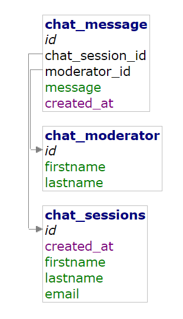

# Ledenbeheer chat app test
## What you need before you start
- Install Docker and make sure `docker-compose` is an existing command
- Git installed and configured
- An account at Gitlab/Github to host your remote repository
- Read this readme

## The application

We are creating a chat application from scratch, so we need:

- A UI, preferabbly in a floating popup and the bottom right
- An API ( in PHP ) to send messages to
- A way to store these messages into a MYSQL table
- An API to get a list of sessions
- An API to get a chat history of a certain session

We are only creating a one way chat app for now, so create a few random responses from the API you're sending your messages to and populate them in your UI. Store these dummy messages in the database and attach one of the default moderators.

## Repository structure
- ./api:
    - PHP part of your application, split into multiple files if needed
    - db.php, sets up your connection to the database, nothing should be changed here in order to work
- ./app:
    - The frontend, there's already an index.html available so build on that file to include your chat popup
    - Please do not use inline CSS or JS, load in seperate files for this

## Database scheme

- Use an existing moderator to link to your chat message if a moderator replies, if the moderator_id is null this means the client sent a message.

## First steps

- Execute `docker-compose up -d` to start your containers, this might take a while so do this first
- Clone this repo to your computer
- Create a file `myname.txt` with your name inside the repository
- Commit these changes right away with a appropriate commit description
- Import `start.sql` found in your root directory into the database, you can use adminer for this (preinstalled using Docker), just visit http://localhost:8080 and login with DB credentials (user is `root`, root password can be found in `docker-compose.yml`)

## Tips and ideas
- Use the small example code in `index.php` to create your endpoints, use q=? as GET param to define which API endpoint is used, bonus points if you rewrite it with htaccess :)
- Comment your code, but only where useful
- Make use of multiple commits during your session when small parts are done
- We are looking for clean code, especially non-duplicated code.
- Do not use PHP submission for your messages, use JS to send out requests so it does not need to reload the page.
- On open window or first message sent a session needs to be started so all messages can be grouped in a session
- Bonus points if you can have a chat session still existing on page reload

## Send in your work

After one hour send in your work, if its not done yet commit all of your code now and execute the following steps:
- Make a last commit with all your work, make sure to include `FINAL` as a verb so we know
- Push the repo to your remote Git repo of choice, just make sure it is publically available
- Send in the link of your repository to info@ledenbeheer.be

If you wish to continue after time, feel free to do so.